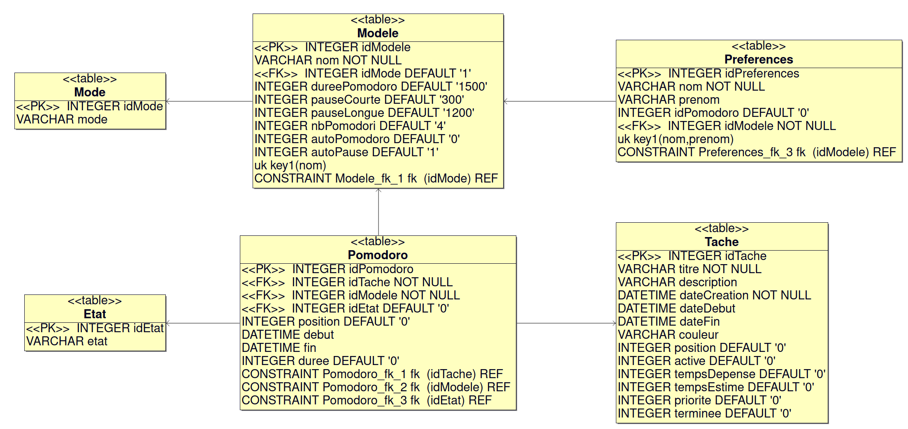
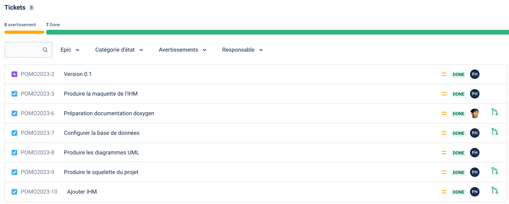
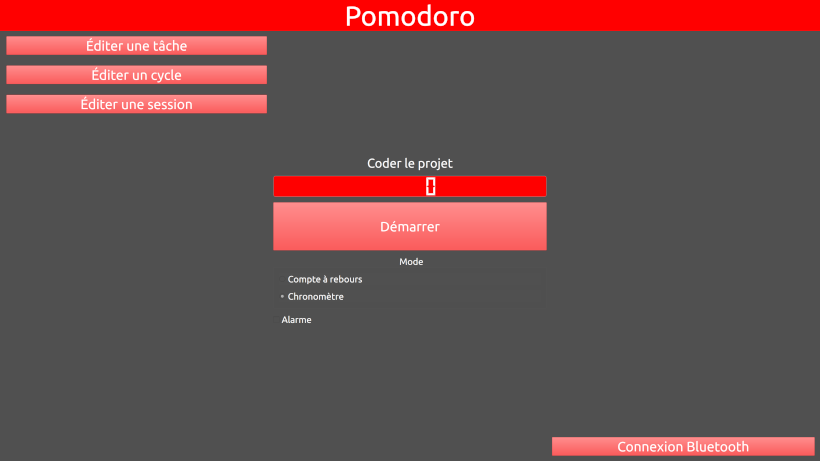

  

[](https://github.com/btssn-lasalle-84/pomodoro-2023/actions/workflows/make-qt.yml) [](https://github.com/btssn-lasalle-84/pomodoro-2023/actions/workflows/pages/pages-build-deployment)

# Le projet pomodoro-2023

- [Le projet pomodoro-2023](#le-projet-pomodoro-2023)
  - [Documentation du code](#documentation-du-code)
  - [Base de données](#base-de-données)
  - [Versions](#versions)
    - [0.1](#01)
  - [Auteur](#auteur)

---

La **technique Pomodoro** est une technique de gestion du temps développée par Francesco Cirillo à la fin des années 1980. Cette méthode se base sur l'usage d'un minuteur permettant de respecter des périodes de 20 minutes appelées pomodori (qui signifie en italien « tomates »).

Francesco Cirillo propose une approche se basant notamment sur un minuteur mécanique. L’idée du projet est donc de conserver un “objet concret” pour en faire un minuteur connecté.


Le système est composé :

- d’un minuteur connecté (ESP32, écran tactile, avertisseur sonore et éventuellement boutons) [Étudiant EC]
- d’une application sur Raspberry Pi et écran tactile pour le pilotage à distance et la gestion des tâches [Étudiant IR]

---

## Documentation du code

https://btssn-lasalle-84.github.io/pomodoro-2023/

## Base de données

Base de données SQLite :



```sql
-- Supprime les tables (si besoin)

DROP TABLE IF EXISTS Preferences;
DROP TABLE IF EXISTS Pomodoro;
DROP TABLE IF EXISTS Etat;
DROP TABLE IF EXISTS Modele;
DROP TABLE IF EXISTS Tache;
DROP TABLE IF EXISTS Mode;

--- Création des tables

-- Structure de la table Mode

CREATE TABLE IF NOT EXISTS Mode(idMode INTEGER PRIMARY KEY, mode VARCHAR);

-- Deux modes de base

INSERT INTO Mode(idMode,mode) VALUES
(1,'Minuteur'),
(2,'Chronomètre');

-- ---------------------------------------------------------------------

-- Structure de la table Modele

CREATE TABLE IF NOT EXISTS Modele (
  idModele INTEGER PRIMARY KEY AUTOINCREMENT,
  nom VARCHAR NOT NULL,
  idMode INTEGER DEFAULT '1',
  dureePomodoro INTEGER DEFAULT '1500',
  pauseCourte INTEGER DEFAULT '300',
  pauseLongue INTEGER DEFAULT '1200',
  nbPomodori INTEGER DEFAULT '4',
  autoPomodoro INTEGER DEFAULT '0',
  autoPause INTEGER DEFAULT '1',
  UNIQUE(nom),
  CONSTRAINT Modele_fk_1 FOREIGN KEY (idMode) REFERENCES Mode(idMode) ON DELETE CASCADE
);

INSERT INTO Modele (nom,dureePomodoro,pauseCourte,pauseLongue,nbPomodori,autoPomodoro,autoPause) VALUES ('Classique','1500','300','1200','4','0','1');
INSERT INTO Modele (nom,dureePomodoro,pauseCourte,pauseLongue,nbPomodori,autoPomodoro,autoPause) VALUES ('Personnel','1800','60','1500','4','0','1');
INSERT INTO Modele (nom,dureePomodoro,pauseCourte,pauseLongue,nbPomodori,autoPomodoro,autoPause) VALUES ('Travail','3000','600','1200','2','0','1');

-- ---------------------------------------------------------------------

-- Structure de la table Etat

CREATE TABLE IF NOT EXISTS Etat(idEtat INTEGER PRIMARY KEY, etat VARCHAR);

INSERT INTO Etat(idEtat,etat) VALUES
(0,'prêt'),
(1,'démarré'),
(2,'pause'),
(3,'terminé');

-- ---------------------------------------------------------------------

-- Structure de la table Tache

CREATE TABLE IF NOT EXISTS Tache (
  idTache INTEGER PRIMARY KEY AUTOINCREMENT,
  titre VARCHAR NOT NULL,
  description VARCHAR,
  dateCreation DATETIME NOT NULL,
  dateDebut DATETIME,
  dateFin DATETIME,
  couleur VARCHAR,
  position INTEGER DEFAULT '0',
  active INTEGER DEFAULT '0',
  tempsDepense INTEGER DEFAULT '0',
  tempsEstime INTEGER DEFAULT '0',
  priorite INTEGER DEFAULT '0',
  terminee INTEGER DEFAULT '0'
);

-- ---------------------------------------------------------------------

-- Structure de la table Pomodoro

CREATE TABLE IF NOT EXISTS Pomodoro (
  idPomodoro INTEGER PRIMARY KEY AUTOINCREMENT,
  idTache INTEGER NOT NULL,
  idModele INTEGER NOT NULL,
  idEtat INTEGER DEFAULT '0',
  position INTEGER DEFAULT '0',
  debut DATETIME,
  fin DATETIME,
  duree INTEGER DEFAULT '0',
  CONSTRAINT Pomodoro_fk_1 FOREIGN KEY (idTache) REFERENCES Tache(idTache) ON DELETE CASCADE,
  CONSTRAINT Pomodoro_fk_2 FOREIGN KEY (idModele) REFERENCES Modele(idModele) ON DELETE CASCADE,
  CONSTRAINT Pomodoro_fk_3 FOREIGN KEY (idEtat) REFERENCES Etat(idEtat) ON DELETE CASCADE
);

-- ---------------------------------------------------------------------

-- Structure de la table Preferences

CREATE TABLE IF NOT EXISTS Preferences (
  idPreferences INTEGER PRIMARY KEY AUTOINCREMENT,
  nom VARCHAR NOT NULL,
  prenom VARCHAR,
  idPomodoro INTEGER DEFAULT '0',
  idModele INTEGER NOT NULL,
  UNIQUE(nom,prenom),
  -- CONSTRAINT Preferences_fk_2 FOREIGN KEY (idPomodoro) REFERENCES Pomodoro(idPomodoro) ON DELETE CASCADE,
  CONSTRAINT Preferences_fk_3 FOREIGN KEY (idModele) REFERENCES Modele(idModele) ON DELETE CASCADE
);

-- ---------------------------------------------------------------------
```

## Versions

### 0.1





## Auteur

- Étudiant IR : Pierre HIRSCH

---
©️ LaSalle Avignon 2023
