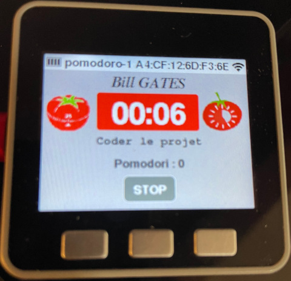

# Simulateur POMODORO 2023

- [Simulateur POMODORO 2023](#simulateur-pomodoro-2023)
  - [Configuration du simulateur](#configuration-du-simulateur)
  - [Protocole](#protocole)
  - [Fonctionnement](#fonctionnement)
  - [platform.ini](#platformini)
  - [Auteur](#auteur)

Ce document présente rapidement le fonctionnement du simulateur ainsi que le protocole implémenté. Le protocole complet est disponible dans Google Drive. Actuellement, la version du protocole est la **0.X**.



## Configuration du simulateur

Pour la simulation, les durées en minutes sont transformées en secondes :

```cpp
#define DUREE_POMODORO        25 //1500 // 25 minutes
#define PAUSE_COURTE_POMODORO 5  //300  // 5 minutes
#define PAUSE_LONGUE_POMODORO 20 //1200 // 20 minutes
#define NB_POMODORI           4
```

## Protocole

Les éléments de base du protocole :

```cpp
#define PERIPHERIQUE_BLUETOOTH  "pomodoro-1"
```

Les différentes types de trame :

```cpp

```

Le format général des trames est le suivant : `...`

Chaque trame reçue entraîne l'envoi d'une trame d'acquittement `...` ou d'erreur `...` par le simulateur.

Les codes d'erreur :

```cpp
#define ERREUR_TRAME_INCONNUE       0
#define ERREUR_TRAME_NON_SUPPORTEE  1
#define ERREUR_COMMANDE             2
#define ERREUR_PARAMETRE            3
#define ERREUR_CONFIGURATION        4
```

La trame `ETAT` précise l'état du pomodoro : `...`

Les différents états sont :

```cpp
enum EtatPomodoro
{
  EnAttente       = -1,
  Termine         =  0,
  EnCours         =  1,
  EnCourtePause   =  2,
  FinCourtePause  =  3,
  EnLonguePause   =  4,
  FinLonguePause  =  5,
  Gele            =  6,
  Reprise         =  7
};
```

La trame de démarrage d'une tâche possède le format suivant : `...` où il est possible de donner un nom à la tâche.

La trame de démarrage d'une pause possède le format suivant : `...`

```cpp
enum TypePause
{
  Invalide = -1,
  COURTE, LONGUE,
  NB_TYPES_PAUSE
};
```

Les possibilités de configuration sont :

```

```

Le champ `mode` admet deux valeurs :

```cpp
enum Mode
{
  Minuteur = 0,
  Chronometre = 1
};
```

_Remarque :_ le mode `Chronometre` n'est pas géré actuellement.

En option (on géré actuellement) : Les trames `...` (WAIT) et `...` (DARN) permettent respectivement de geler le temps (d'une tâche ou d'une pause) ou de le reprendre.

## Fonctionnement

Pour l'instant, le simulateur ne fonctionne qu'en mode `Minuteur`.

## platform.ini

```ini
[env:m5stack-core-esp32]
platform = espressif32
board = m5stack-core-esp32
board_build.partitions = no_ota.csv
framework = arduino
lib_deps =
  # M5Stack
  1851
build_flags=-std=gnu++11
upload_port = /dev/ttyUSB0
monitor_port = /dev/ttyUSB0
monitor_speed = 115200
```

## Auteur

- Thierry Vaira <<tvaira@free.fr>>
